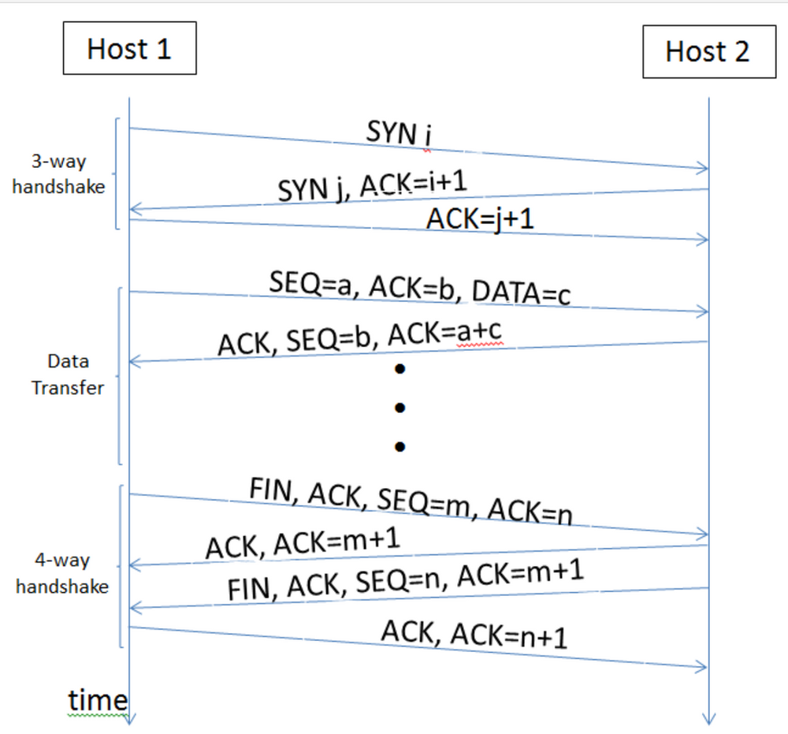
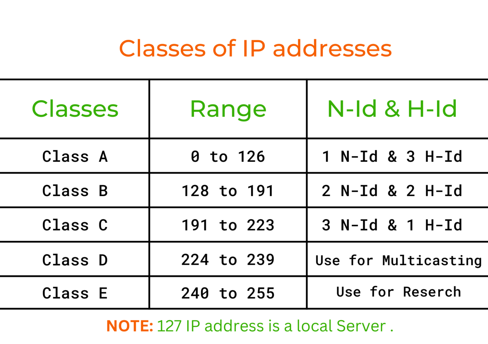
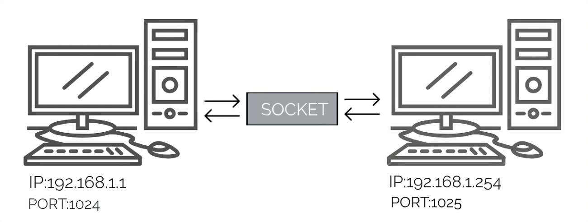
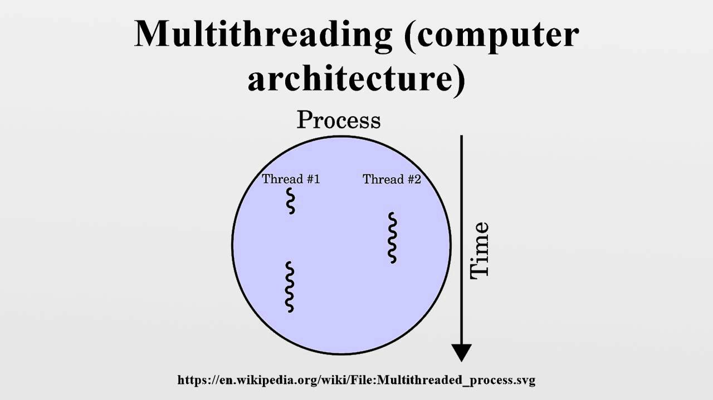

# Capstone Reflection

Building the client-server chat application for my capstone project was both a technical challenge and a significant personal learning experience. I was excited about diving into the world of networking—including TCP protocols, IP addressing, and socket programming. However, the process presented several obstacles that initially seemed challenging. As I worked through these challenges, I found the experience to be incredibly valuable, not only in terms of technical growth but also in developing problem-solving resilience. Throughout this project, I learned that facing difficulty head-on is an essential part of the development process. While there were moments of frustration—when errors didn’t make sense or the program behaved unexpectedly—each obstacle I overcame deepened my understanding of the concepts and boosted my confidence.

## Terminalogies

### 1. Transmission Control Protocol (TCP)

TCP was essential for ensuring reliable and ordered message delivery in my chat application. It allowed me to build a more stable and user-friendly app while also reinforcing my understanding of how real-time communication systems rely on protocols to maintain data integrity. Without TCP, my chat app would have been prone to errors like message loss or out-of-order messages, which could seriously impact the user experience.

Initially, I was challenged by the idea of working with networking protocols, as it felt abstract and out of my comfort zone. However, diving into TCP and using tools like Wireshark opened my eyes to how fundamental these protocols are in our everyday digital interactions. 

Learning the TCP protocol lead me to understanding the deeper layers of communication between computers. It emphasized the importance of reliability in networked systems, something that will be crucial as I take on more complex projects in the future. This knowledge has given me a strong foundation for tackling real-world networking issues, which will undoubtedly help me in both academic and professional settings.

### [Wireshark Analysis](/Documentation/capstoneDocs/wiresharkAnalysis.md)

### 2. Internet Protocol (IP)
Understanding IP addresses is fundamental to grasping how devices communicate over a network. In my project, I began by using the localhost address (127.0.0.1) for testing, but transitioned to a more flexible configuration (0.0.0.0) which expanded the testing scope beyond local connections, revealing new challenges in my implementation. I had to ensure my error handling was robust enough to manage unexpected disconnections, which occurred more frequently when testing across different devices.  These real-world networking scenarios provided valuable insights into deployment considerations that weren't apparent during localhost testing.

### 3. Sockets and Ports
Sockets and ports formed the backbone of communication between the server and clients. By correctly managing sockets and selecting the right ports, I was able to ensure smooth and reliable connections. 

When working with sockets and ports in my chat application, I found netstat to be an invaluable troubleshooting tool. As I was developing the server component, I encountered several issues with ports already being in use or connections not being properly released. The command Netstat became my go-to diagnostic tool, allowing me to visualize and understand the state of network connections on my system. By using commands like netstat -an, I could see all active connections and listening ports, which proved crucial for identifying socket-related issues. 

### 4. Multithreading for Handling Multiple Clients
To handle multiple clients simultaneously without blocking communication, I implemented multithreading on the server side. Each client was assigned a separate thread, ensuring that the server could handle many connections at once, which significantly improved performance.

This was a crucial learning experience, as multithreading is fundamental for developing high-performance applications. Understanding concurrency and managing thread synchronization taught me how to design more efficient and scalable systems. The ability to handle multiple clients concurrently is essential for building modern applications that can handle high traffic and provide a seamless user experience.

When I first began learning about multithreading, I encountoucd theory issused but as I worked through the problems, I began to appreciate the elegance of multithreading in enabling scalable, high-performance systems. This experience challenged me to think more deeply and taught valuable lessons about system architecture. It also boosted my confidence in handling concurrency issues—something I can now apply to future projects with greater ease.

### 5. Database Design and Management with SQLite

Working with SQLite for my chat application was a significant learning experience that expanded my understanding of database design and management. Initially, I found it challenging to map out the relationships between users, chatrooms, and messages in a way that would be both efficient and maintainable. Creating tables for users, chatrooms, chatroom_members, messages, and private_messages required careful consideration of foreign keys and relationship types. The process of designing and implementing the database schema taught me valuable lessons about data normalization and integrity. I had to ensure that operations like user registration, message storage, and chatroom management maintained data consistency while also being performant. This balance between data integrity and application performance was a constant consideration throughout development. Implementing features like private messaging and read/unread message tracking required more complex database queries than I initially anticipated. Learning to write effective SQL queries for these features deepened my understanding of how database operations impact overall application functionality and user experience. As I worked with SQLite, I gained practical experience with transactional database operations, which was crucial for maintaining data integrity during critical operations like account removal. Understanding how to properly begin transactions, commit changes, and handle rollbacks in case of errors proved invaluable for ensuring the reliability of my application. This experience with database management has given me a much stronger foundation in back-end development and data persistence strategies that I'll carry forward to future projects.

## Conclusion

This capstone project was not only an opportunity to apply my technical knowledge but also to reflect on my growth as a software engineer. Each concept I learned, from TCP to multithreading, added a new layer of understanding to how networked applications are built and managed. The challenges I faced made me more resilient, teaching me that success comes from not just solving technical problems but also from developing the patience and persistence to work through setbacks.

In terms of personal growth, this project has helped me build confidence in areas I once found intimidating, like networking and concurrency. It showed me that problems—whether they are bugs, connectivity issues, or system design challenges—are not obstacles, but opportunities to learn and grow. As I look ahead, I feel more prepared to tackle complex, real-world problems and continue developing as a IT Professional.

