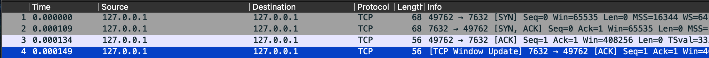
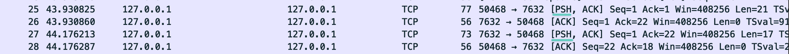
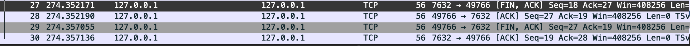
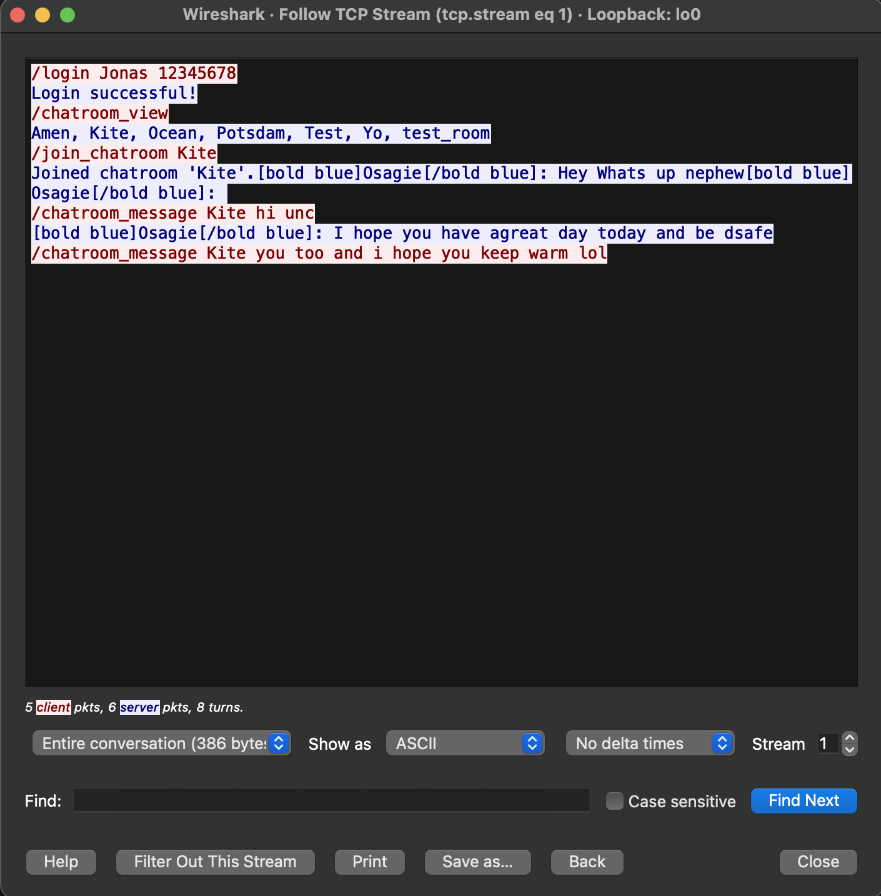

# Wireshark Analysis

This analysis dives into the network traffic captured from a chat application using Wireshark, focusing on the **TCP 3-way handshake, message transmission, and overall communication behavior**. It also examines sequence numbers, flow control, error handling, timing, and connection termination details, showcasing a deeper understanding of TCP.

## Capture Setup
- **Port Monitored:** `7632`
- **Filter Applied:** `tcp.port == 7632`
- **Environment:** Chat client and server running on local/remote machines

## TCP 3-Way Handshake
The TCP handshake establishes a connection between the client and server before data transmission, including the setup of initial sequence numbers that track data segments.

#### Client Connects to Server

**SYN (Client to Server):**  
The chat client initiates a connection by sending a SYN packet to the server, indicating its intention to start a conversation. Notice the initial sequence number (ISN) which will be used to track subsequent data segments.  

**SYN-ACK (Server to Client):**  
The chat server responds with a SYN-ACK packet, acknowledging the client's ISN and providing its own ISN, thereby setting the stage for synchronized communication.

**ACK (Client to Server):**  
The chat client sends an ACK packet that finalizes the handshake by acknowledging the server’s ISN. This completes the three-way handshake and establishes a reliable connection with negotiated window sizes for flow control.

This process not only confirms that both parties are active but also sets up essential parameters—such as sequence numbers and window sizes—for managing the flow of data.

## Message Transmission
After the handshake, the client and server exchange chat messages and commands over the established connection.

#### Message/Command Sending

- **PSH (Push):**  
  This flag instructs the receiver to process the incoming data immediately rather than waiting for the buffer to fill. This immediacy is crucial for real-time applications like chat.

- **ACK (Acknowledgment):**  
  ACK packets confirm the receipt of data segments. Each message sent is tracked by sequence numbers, and the corresponding ACK numbers ensure that data is reliably received.

### Additional Insights:
- **Sequence and Acknowledgment Numbers:**  
  Each data segment is tagged with a sequence number, and the corresponding ACK ensures that the receiver got the expected bytes. This mechanism underpins TCP’s reliability and error-checking process.
  
- **Window Size and Flow Control:**  
  The TCP header’s window size fields indicate how much data can be sent before waiting for an acknowledgment. This flow control is essential to prevent overwhelming either end of the connection.

- **Timing and Latency Analysis:**  
  By examining the timestamps in Wireshark, you can calculate the round-trip time (RTT) for packets. This measurement helps assess network latency, which is critical for ensuring that real-time communication (like chat messages) is responsive.

These details—sequence numbers, window sizes, and timing—work together with the PSH and ACK flags to guarantee that data is transmitted efficiently and reliably.

## Connection Termination
A TCP connection should be closed properly using the **FIN-ACK** sequence to ensure that both parties safely release connection resources.

#### Connection Termination Process

**FIN (Initiated by Client/Server):**  
The sender starts the termination process by sending a FIN packet, indicating that it has no more data to send.

**ACK (Response from Peer):**  
The receiving peer acknowledges the FIN packet with an ACK, confirming that the termination request has been received.

**FIN (Initiated by Peer):**  
The peer then sends its own FIN packet to signal that it is also ready to terminate the connection.

**Final ACK (Final Response by Sender):**  
The original sender replies with a final ACK, completing the four-step termination process.

### Additional Termination Details:
- **TIME_WAIT State:**  
  After the final ACK, the connection typically enters a TIME_WAIT state. This state ensures that any delayed packets are properly handled and prevents confusion with future connections.
  
- **Error Handling:**  
  The orderly shutdown using FIN and ACK packets ensures that any remaining data is acknowledged and that the connection is terminated gracefully without data loss.

The proper use of FIN and ACK flags, along with the TIME_WAIT mechanism, ensures that the TCP connection is closed reliably, preventing hanging connections and potential errors.

#### Packet Data Stream

## Conclusion
This analysis confirms that the chat application adheres to standard TCP behavior:
- The **3-way handshake** is correctly executed with proper sequence number negotiation and window size establishment.
- Chat messages are transmitted efficiently using **PSH-ACK** flags, with reliable sequence and acknowledgment mechanisms ensuring data integrity.
- The connection is gracefully terminated with a **FIN-ACK** sequence, including a transition into the TIME_WAIT state to guarantee complete closure.

