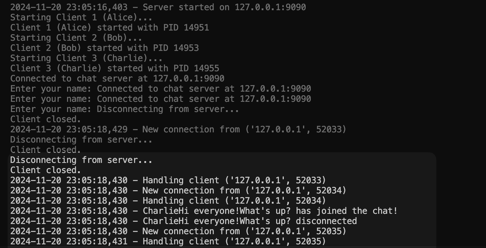

 * author: Osagie Owie
 * email: owieo204@potsdam.edu
 * course: CIS 480 Senior Project
 * assignment: Senior Project
 * due 12/9/24 


# TCP Chat Application

## Description
This project is a TCP-based chat application for real-time communication between multiple clients connected to a central/main server. It offers a command-line interface alongside a graphical user interface (GUI), supports private and broadcast messaging, file sharing, and seamless reconnection for disconnected clients.

## Features
- **Server Features**:
  - User authentication.
  - Client management with unique identifiers.
  - Broadcast, private, and group messaging.
  - File sharing with bandwidth management.

- **Client Features**:
  - Command-line and GUI-based interfaces.
  - Real-time message sending and receiving.
  - Notifications for new messages and connection status.

## Technology Stack
- **Programming Language**: Python
- **Libraries**: `socket`, `threading`, `tkinter`

## How to Run + Environment Setup
1. Clone the repository:
   ```bash 
   git clone https://cs-devel.potsdam.edu/S24-480-owieo204/tcp-chat.git

- Since we are using one machine for now, create 3 different terminal sessions to simulate 3 connected machines .

2. Run server.py
    ```bash
    python3 server.py

3. Run client.py
    ```bash
    python3 client.py --host 127.0.0.1 --port 9090 


## Program Execution Instructions  
 
1. After __Python3 client.py__ is ran, Enter your chat name.
2. Write text in client.py CLI and it will broadcast to any other client that is is our server.
    - Open multiple terminal sessions and run python3 client.py again.


## __Testing__
## Testing Log

| Test #  | Test Name               | Description                                         | Expected Result                          | Actual Result      | Status  |
|---------|-------------------------|-----------------------------------------------------|------------------------------------------|--------------------|---------|
| 1       | Simultaneous Messaging  | Test simultaneous chatting between two clients.     | Both clients send and receive messages.  | Messages exchanged with data loss issues. | [ ] In progress |
| 2       | Server Startup          | Start the server and ensure it listens on the port. | Server starts without errors.            | TBD                | [ ] In Progress |
| 3       | Client Connection       | Connect a single client to the server.              | Client successfully connects.            | TBD                | [ ] In Progress |

## Testing Information

- Program was tested on one machine. I intend to test it out with multiple machines.

## Simultaneous Messaging

**Objective**:  
Verify that multiple clients will be able to send and receive messages at the same time without conflicts or data loss.

**Setup**:  
- Started the server on one terminal session.  
- Connected two clients to the server from separate terminal sessions.  
- Initiated simultaneous message exchanges between the clients using the script "__testChat.sh__". 
  - __Test Script Description: testChat.sh__  
    __testChat.sh__ connects two clients to the server with each client running in 
    separate threads, and sends messages from both clients at the same time. It checks for 
    proper receipt of messages without delays, duplication, or loss, ensuring real-time
    communication functionality. 
      
  - __Test Script Description: portClear.sh__   
    __portClear.sh__ clears ports from being used that may get clobbered when running these test. This is to ensure
    a port is open before testing on it.
          
**Results**:  
- When running my tests, data appears to be lost. Im expected more dialouge from the other two clients "Alice" and "Bob".    

<div align="center">
    
</div>


## Known Bugs

- When you disconnect a client, the server loses track of connected clients.

